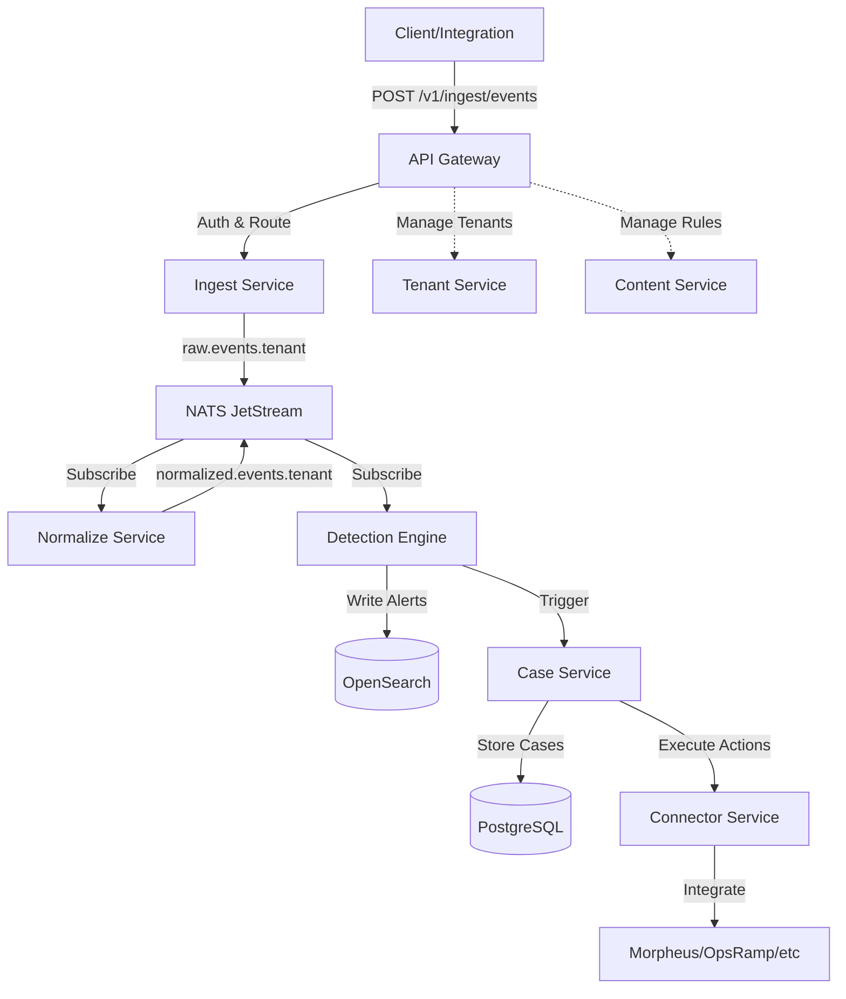

# Multi-Tenant SIEM + SOAR Platform

An open-source, multi-tenant SIEM + SOAR platform designed for hybrid cloud and the HPE ecosystem.

## Architecture Overview

This platform provides production-grade security event ingestion, detection, case management, and SOAR orchestration with multi-tenancy from day one.

### Core Services

| Service               | Language       | Purpose                                             |
| --------------------- | -------------- | --------------------------------------------------- |
| **api-gateway**       | Python/FastAPI | Authentication, tenant routing, RBAC, rate limiting |
| **ingest-service**    | Go             | High-performance event ingestion via HTTP/Syslog    |
| **normalize-service** | Python         | Event normalization to canonical schema             |
| **detect-service**    | Python         | Rule-based detection engine                         |
| **case-service**      | Python         | Incident case management                            |
| **connector-service** | Python         | SOAR integrations (Morpheus, OpsRamp, etc.)         |
| **tenant-service**    | Go             | Tenant management and configuration                 |
| **content-service**   | Python         | Detection rule and playbook management              |

### Technology Stack

- **Languages**: Go (high-throughput), Python FastAPI (business logic)
- **Event Bus**: NATS JetStream
- **Storage**: OpenSearch (events/alerts), PostgreSQL (control plane/cases)
- **Orchestration**: Kubernetes with Helm charts
- **Security**: JWT authentication, OIDC-ready, strict RBAC

### Architecture Diagram



## Quick Start

### Prerequisites

- **Docker Desktop** or **Podman** (for container builds)
- **Kubernetes** (Kind, K3d, or Minikube recommended for local dev)
- **kubectl** (Kubernetes CLI)
- **Helm** v3+ (package manager)
- **Go** 1.21+ (for Go services)
- **Python** 3.11+ (for Python services)
- **Make** (build automation)

Minimum resources: **16GB RAM**, **4 CPU cores**, **50GB disk**

### Local Development Setup

```bash
# 1. Clone the repository
git clone <repository-url>
cd siem-platform

# 2. Bootstrap local Kubernetes cluster (Kind)
make dev-up

# 3. Wait for all services to be ready (~2-3 minutes)
kubectl get pods -n siem-platform --watch

# 4. Create a test tenant
make seed

# 5. Access the API gateway
export API_URL=http://localhost:8080
```

### Test the Walking Skeleton

```bash
# Get a tenant token (from seed output)
export TENANT_TOKEN="<your-token>"
export TENANT_ID="acme-corp"

# Ingest 10 failed login events
for i in {1..10}; do
  curl -X POST $API_URL/v1/ingest/events \
    -H "X-Tenant-ID: $TENANT_ID" \
    -H "Authorization: Bearer $TENANT_TOKEN" \
    -H "Content-Type: application/json" \
    -d '{
      "category": "auth",
      "severity": 5,
      "actor": {"id": "user123", "name": "john.doe"},
      "target": {"id": "webapp-1", "name": "Corporate Portal"},
      "attributes": {
        "failed_login_count": 1,
        "source_ip": "203.0.113.42",
        "user_agent": "Mozilla/5.0"
      }
    }'
done

# Verify alert was created
curl -X GET "$API_URL/v1/alerts?tenant_id=$TENANT_ID" \
  -H "Authorization: Bearer $TENANT_TOKEN"

# Verify case was created
curl -X GET "$API_URL/v1/cases" \
  -H "X-Tenant-ID: $TENANT_ID" \
  -H "Authorization: Bearer $TENANT_TOKEN"
```

Expected result: An alert for "10 failed logins in 5 minutes" and an automatically created case.

## Makefile Commands

| Command           | Description                                      |
| ----------------- | ------------------------------------------------ |
| `make dev-up`     | Start local Kubernetes cluster with all services |
| `make dev-down`   | Tear down local cluster                          |
| `make test`       | Run all unit and integration tests               |
| `make lint`       | Run linters (golangci-lint, flake8, mypy)        |
| `make fmt`        | Format all code (gofmt, black)                   |
| `make seed`       | Create test tenant and sample data               |
| `make build`      | Build all Docker images                          |
| `make deploy-dev` | Deploy to dev environment                        |

## Multi-Tenancy

Every request, event, and record includes tenant context:

- **API Layer**: `X-Tenant-ID` header + JWT `tenant_id` claim validation
- **Event Bus**: Tenant-scoped topics (`raw.events.{tenant_id}`)
- **Storage**:
  - OpenSearch: Index per tenant (`alerts-{tenant_id}`)
  - PostgreSQL: Row-level `tenant_id` filtering
- **Isolation**: Cross-tenant access is forbidden (returns 404)

See [Multi-Tenancy Design](docs/architecture/multi-tenancy.md) for details.

## Security

- **Authentication**: JWT tokens with OIDC support
- **Authorization**: RBAC with 4 roles:
  - `platform_admin` - Platform-wide administration
  - `tenant_admin` - Tenant configuration
  - `soc_analyst` - View alerts and cases
  - `auditor` - Read-only access
- **Secrets**: Kubernetes secrets (Vault/CyberArk interface ready)
- **Service-to-Service**: mTLS prepared (optional for MVP)

## Event Schema

All events normalize to a canonical schema:

```json
{
  "tenant_id": "acme-corp",
  "event_id": "123e4567-e89b-12d3-a456-426614174000",
  "timestamp": "2026-01-21T20:00:00Z",
  "source": {
    "system": "active-directory",
    "integration": "windows-event-log"
  },
  "category": "auth",
  "severity": 5,
  "actor": {
    "type": "user",
    "id": "john.doe@acme.com",
    "name": "John Doe"
  },
  "target": {
    "type": "workload",
    "id": "webapp-1",
    "name": "Corporate Portal"
  },
  "attributes": {
    "failed_login_count": 1,
    "source_ip": "203.0.113.42"
  }
}
```

Categories: `auth`, `endpoint`, `network`, `cloud`, `k8s`, `storage`, `ops`

See full schema: [canonical_event.json](docs/schema/canonical_event.json)

## Development

### Adding a New Service

1. Create service directory: `/services/my-service/`
2. Implement service following patterns in existing services
3. Create Dockerfile with multi-stage build
4. Create Helm chart in `/deploy/helm/my-service/`
5. Add to umbrella chart dependencies
6. Update documentation

See: [Service Development Guide](docs/development.md)

### Adding a Connector

1. Create connector class in `/services/connector-service/connector/connectors/`
2. Extend `BaseConnector` abstract class
3. Implement `execute_action()`, `validate_config()`, `health_check()`
4. Add connector to registry
5. Write tests
6. Document in `/docs/connectors/`

See: [Connector Development Guide](docs/connectors/development_guide.md)

### Adding a Detection Rule

1. Create rule in `/services/detect-service/detect/rules/`
2. Implement rule logic with tenant-aware state
3. Define alert schema
4. Write unit tests
5. Document rule in content service

## Repository Structure

```
siem-platform/
├── services/                 # Microservices
│   ├── api-gateway/         # FastAPI - Auth, routing, RBAC
│   ├── ingest-service/      # Go - Event ingestion
│   ├── normalize-service/   # Python - Event normalization
│   ├── detect-service/      # Python - Detection engine
│   ├── case-service/        # Python - Case management
│   ├── connector-service/   # Python - SOAR integrations
│   ├── tenant-service/      # Go - Tenant management
│   └── content-service/     # Python - Rule/playbook management
├── libs/
│   └── common/              # Shared libraries (auth, schemas, utils)
├── deploy/
│   ├── helm/                # Helm charts per service + umbrella
│   └── kustomize/           # Environment overlays (dev/staging/prod)
├── docs/
│   ├── schema/              # Event schemas (JSON Schema)
│   ├── architecture/        # Architecture docs, ADRs
│   └── connectors/          # Connector documentation
├── scripts/
│   ├── bootstrap/           # Cluster setup scripts
│   └── dev/                 # Development utilities
├── Makefile                 # Build automation
└── README.md                # This file
```

## Walking Skeleton Flow

The minimal end-to-end flow demonstrates all core components:

1. **Ingest**: Client sends event → `ingest-service` → NATS `raw.events.{tenant}`
2. **Normalize**: `normalize-service` transforms → NATS `normalized.events.{tenant}`
3. **Detect**: `detect-service` applies rule (10 failed logins in 5 min) → alert
4. **Alert**: Alert written to OpenSearch `alerts-{tenant}`
5. **Case**: `case-service` auto-creates case, links alert, stores in PostgreSQL
6. **Action**: (Optional) `connector-service` executes playbook action

Time: **<5 seconds** from ingestion to case creation

## CI/CD

GitHub Actions workflows:

- **Lint**: `golangci-lint`, `flake8`, `mypy`, `black --check`
- **Test**: Unit and integration tests across all services
- **Build**: Docker image builds
- **Deploy**: GitOps with ArgoCD (coming soon)

## Roadmap

### ✅ Phase 1: Walking Skeleton (Current)

- Core services operational
- One detection rule
- Basic multi-tenancy
- Local Kubernetes deployment

### 🚧 Phase 2: Enhanced Detection (Next)

- Rule engine framework
- Redis-backed state store
- Multiple detection rules
- Correlation engine

### 📋 Phase 3: SOAR Orchestration

- Playbook engine
- 10+ connector integrations
- Workflow automation
- Case enrichment

### 📋 Phase 4: Enterprise Features

- SAML/OIDC integration
- Advanced RBAC
- Compliance reporting
- Data export (SIEM interop)

## Contributing

This is an open-source project. Contributions welcome!

1. Fork the repository
2. Create a feature branch
3. Follow coding standards (see below)
4. Write tests (minimum 70% coverage)
5. Submit pull request

### Coding Standards

- **Go**: `gofmt`, `golangci-lint`, structured logging (zerolog)
- **Python**: `black`, `flake8`, `mypy`, FastAPI patterns, pydantic models
- **Commits**: Conventional commits format
- **Documentation**: Update docs with code changes

## License

[Apache 2.0](LICENSE) (or your chosen open-source license)

## Support

- **Documentation**: [docs/](docs/)
- **Issues**: GitHub Issues
- **Discussions**: GitHub Discussions
- **Slack**: (coming soon)

## Acknowledgments

Built for the HPE ecosystem and hybrid cloud environments with contributions from the security and DevOps communities.

---

**Status**: 🚧 Active Development - MVP Walking Skeleton Complete
